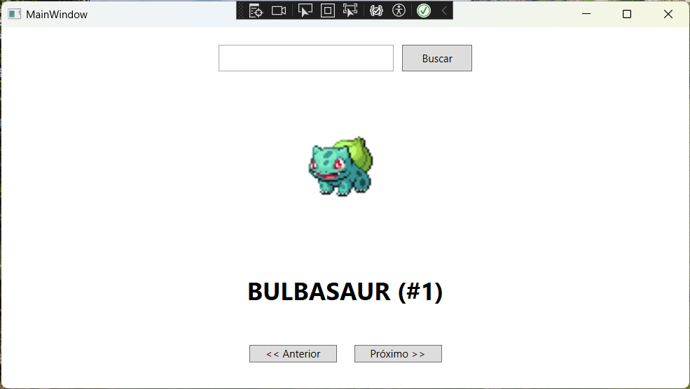

# Pokédex WPF - Teste para Vaga de Desenvolvedor C# + Windows Pleno

Este projeto é uma Pokédex criada em **C#** utilizando **WPF (Windows Presentation Foundation)** como parte de um teste técnico. Ele consome dados da [PokéAPI](https://pokeapi.co/) para exibir informações e imagens dos Pokémons em uma interface amigável.

---

## 🛠️ Tecnologias Utilizadas

- **.NET 8.0**  
- **C#**
- **WPF (Windows Presentation Foundation)**
- **JSON** (via `HttpClient` e `System.Text.Json`)
- **API REST** - [https://pokeapi.co/](https://pokeapi.co/)

---

## 🧱 Estrutura do Projeto

```
Pokedex/
│
├── MainWindow.xaml          # Interface principal (XAML)
├── MainWindow.xaml.cs       # Lógica de navegação, busca e carregamento de dados
├── Models/
│   └── Pokemon.cs           # Modelo para os dados recebidos da API
├── Services/
│   └── PokeApiService.cs    # Classe de serviço que consome a API
├── Resources/               # Imagens ou estilos (se houver)
├── App.xaml                 # Arquivo de configuração da aplicação
└── Pokedex.csproj           # Projeto .NET
```

---

## 🚀 Como Rodar o Projeto

### Pré-requisitos

- [.NET SDK 8.0](https://dotnet.microsoft.com/en-us/download/dotnet/8.0)
- Visual Studio 2022 ou superior com suporte a projetos WPF
- Conexão com a internet (para acessar a API)

### Passos

1. Clone este repositório:

```bash
git clone https://github.com/heliogald/Pokedex.git
```

2. Abra o arquivo `Pokedex.sln` com o **Visual Studio**

3. Marque o projeto como "Projeto de Inicialização"

4. Pressione `F5` para compilar e executar o projeto

---

## 🔍 Funcionalidades

- Buscar Pokémon pelo nome ou número
- Navegar entre os Pokémons com botões de "Próximo" e "Anterior"
- Exibir imagem, nome e uma breve descrição do Pokémon selecionado

---

## 📝 Observações

- O projeto utiliza a PokéAPI, que retorna as informações em inglês por padrão.
- Caso deseje estender a aplicação, é possível adicionar detalhes como **tipo**, **habilidades**, ou **evoluções** dos Pokémons.

---

## 📸 Preview



---

## 📃 Licença

Este projeto foi desenvolvido como parte de um teste técnico. Sinta-se livre para utilizá-lo como base de aprendizado ou portfólio pessoal.